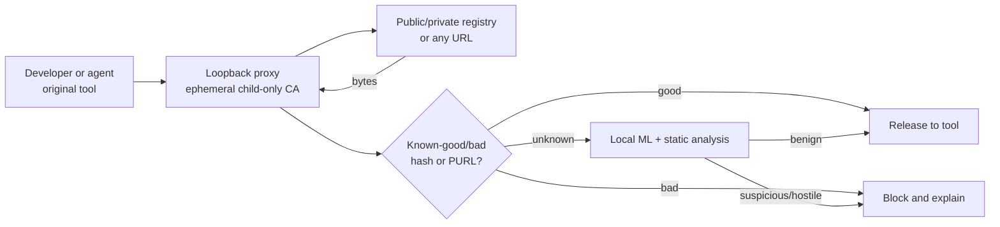

# hood

   

**A local package firewall that inspects downloaded bytes before they reach developer workstations.**

> [!WARNING] Evaluation software, not an enterprise endpoint control. Test in a VM before piloting it with developers.

## Why
Developer machines hold source code, signing keys, registry credentials, cloud tokens, and production access. `hood` blocks suspicious downloads before install scripts execute, analyzes private packages absent from threat feeds, and preserves familiar commands—including `curl | sh`.

## How it works

The host trust store is unchanged. Unknown bytes are analyzed locally by [Atomdrift Scan](https://github.com/atomdrift-project/scan); optional bloom filters fast-path known artifacts.

## Tool coverage
✅ = automatic wrapper; ◐ = experimental explicit command; — = unsupported. Matrix verified against each project's source (August 2026). `hood` also supports `hood exec -- <command>`; only `hood` locally classifies private artifact contents. Competitors may route private packages but decide from feeds or metadata.

| Tool | hood | [PMG](https://github.com/safedep/pmg) | [SCFW](https://github.com/DataDog/supply-chain-firewall) | [Safe Chain](https://github.com/AikidoSec/safe-chain) |
| --- | :---: | :---: | :---: | :---: |
| `curl` | ✅ | — | — | — |
| `wget` | ✅ | — | — | — |
| `npm` | ✅ | ✅ | ✅ | ✅ |
| `npx` | — | ✅ | — | ✅ |
| `pnpm` | ✅ | ✅ | — | ✅ |
| `pnpx` | — | ✅ | — | ✅ |
| `yarn` | ✅ | ✅ | — | ✅ |
| `rush` | — | — | — | ✅ |
| `rushx` | — | — | — | ✅ |
| `bun` | ✅ | ✅ | — | ✅ |
| `bunx` | — | — | — | ✅ |
| `pip` | ✅ | ✅ | ✅ | ✅ |
| `pip3` | — | ✅ | — | ✅ |
| `pipx` | ✅ | ✅ | — | ✅ |
| `uv` | ✅ | ✅ | — | ✅ |
| `uvx` | — | ✅ | — | ✅ |
| `poetry` | ✅ | ✅ | ✅ | ✅ |
| `pdm` | — | — | — | ✅ |
| `go` | ✅ | ◐ | — | — |
| `cargo` | ✅ | — | — | — |
| `brew` | ✅ | — | — | — |
| `pacman` | ✅ | — | — | — |
| `yay` | ✅ | — | — | — |
| `paru` | ✅ | — | — | — |
| `makepkg` | ✅ | — | — | — |
| `dnf` | ✅ | — | — | — |
| `yum` | ✅ | — | — | — |
| `zypper` | ✅ | — | — | — |
| `rpm` | ✅ | — | — | — |
| `apk` | ✅ | — | — | — |
| `pkg` | ✅ | — | — | — |

## Security posture
Strict by default: scan errors and suspicious or hostile content are blocked. User-level shims are bypassable; bodies above 2 GiB are forwarded unscanned; centralized policy, fleet health, approvals, and organization-wide audit are not implemented. PMG, SCFW, and Safe Chain are operationally more mature.

## Evaluate
Requires Rust 1.96+: `git clone https://github.com/atomdrift-project/hood.git && cd hood && make install && hood install`. Restart the shell; remove with `hood uninstall`. `make test` runs the Rust suite; `make test-tools` runs isolated command-level tests against installed toolchains without contacting public registries.
