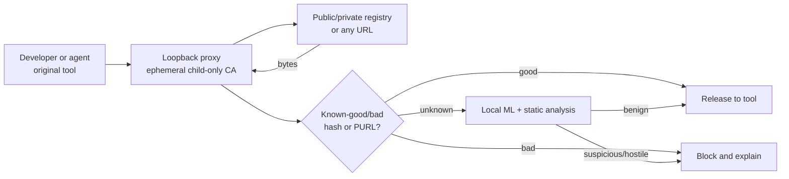

# hood

[](#what) [](https://github.com/atomdrift-project/hood/actions/workflows/ci.yml) [](https://scorecard.dev/viewer/?uri=github.com/atomdrift-project/hood) [](LICENSE)

> [!WARNING] This is experimental. It may eat your cat.
> 
<p align="center"></p>

## What

`hood` is a local enforcement layer for software fetched by developers and AI agents. It inspects unfamiliar public and private artifacts before release to package managers, installers, or `curl`, adding zero-day detection without changing workflows or sending proprietary packages to a third party.

## How it works



Hood creates a fresh CA for each intercepted command and trusts it only in that child process; it never changes the host trust store. Unknown artifacts are analyzed locally by [Atomdrift Scan](https://github.com/atomdrift-project/scan), while optional bloom filters fast-path known artifacts. By default, fetching commands fail closed if scanning cannot start; local operations such as `go test`, `cargo build`, and `npm test` bypass the proxy.

## Tool coverage

✅ = automatic coverage; ◐ = experimental or explicit coverage; — = unsupported. Matrix verified against each project's source (August 2026). Hood also supports arbitrary commands through `hood exec -- <command>`; only Hood locally classifies private artifact contents. Competitors may route private packages but decide from feeds or metadata.

| Tool | hood | [PMG](https://github.com/safedep/pmg) | [SCFW](https://github.com/DataDog/supply-chain-firewall) | [Safe Chain](https://github.com/AikidoSec/safe-chain) |
| --- | :---: | :---: | :---: | :---: |
| `curl` | ✅ | — | — | — |
| `wget` | ✅ | — | — | — |
| `npm` | ✅ | ✅ | ✅ | ✅ |
| `npx` | ✅ | ✅ | — | ✅ |
| `pnpm` | ✅ | ✅ | — | ✅ |
| `pnpx` | ✅ | ✅ | — | ✅ |
| `yarn` | ✅ | ✅ | — | ✅ |
| `rush` | ✅ | — | — | ✅ |
| `rushx` | ✅ | — | — | ✅ |
| `bun` | ✅ | ✅ | — | ✅ |
| `bunx` | ✅ | — | — | ✅ |
| `pip` | ✅ | ✅ | ✅ | ✅ |
| `pip3` | ✅ | ✅ | — | ✅ |
| `pipx` | ✅ | ✅ | — | ✅ |
| `uv` | ✅ | ✅ | — | ✅ |
| `uvx` | ✅ | ✅ | — | ✅ |
| `poetry` | ✅ | ✅ | ✅ | ✅ |
| `pdm` | ✅ | — | — | ✅ |
| `go` | ✅ | ◐ | — | — |
| `cargo` | ✅ | — | — | — |
| `brew` | ✅ | — | — | — |
| `pacman` | ✅ | — | — | — |
| `yay` | ✅ | — | — | — |
| `paru` | ✅ | — | — | — |
| `makepkg` | ✅ | — | — | — |
| `dnf` | ✅ | — | — | — |
| `yum` | ✅ | — | — | — |
| `zypper` | ✅ | — | — | — |
| `rpm` | ✅ | — | — | — |
| `apk` | ✅ | — | — | — |
| `pkg` | ✅ | — | — | — |

## Deploy — Rust 1.96+

```sh
git clone https://github.com/atomdrift-project/hood.git
cd hood
make install
hood install
```

`hood install` adds user-level shims for supported tools already on `PATH`; it requires no system proxy, root CA, or package-manager reconfiguration. Restart the shell and use those tools normally. On macOS, Go needs no manual `SSL_CERT_FILE` setup: Hood preserves `GOPROXY` and `GOSUMDB` verification through a loopback bridge.

Set `HOOD_VERBOSE=1` (or use `-v`) for per-artifact results and a run summary:

```text
✅ Atomdrift Hood scan passed — 3.2% risk score — package.tgz
⚠️ Atomdrift Hood flagged this download as suspicious — 31.0% risk score — BLOCKED
🛑 Atomdrift Hood blocked a high-risk download — 87.0% risk score
🛑 Atomdrift Hood scanned 11 downloads — 8 passed, 2 suspicious, 1 high risk — 2 blocked
```

## GitHub Actions

Pin Hood to a reviewed commit, install its shims, and run existing build commands unchanged:

```yaml
steps:
  - uses: actions/checkout@3d3c42e5aac5ba805825da76410c181273ba90b1 # v7.0.1
    with:
      persist-credentials: false
  - uses: actions/checkout@3d3c42e5aac5ba805825da76410c181273ba90b1 # v7.0.1
    with:
      repository: atomdrift-project/hood
      ref: <reviewed-hood-commit-sha>
      path: .hood-source
      persist-credentials: false
  - name: Install Hood
    env:
      RUSTUP_TOOLCHAIN: 1.96.0
    run: |
      rustup toolchain install 1.96.0 --profile minimal
      make -C .hood-source install
      hood install
      echo "$HOME/.hood/bin" >> "$GITHUB_PATH"
  - name: Install dependencies through Hood
    run: npm ci # or: go mod download, pip3 install -r requirements.txt
```

Uninstall with `hood uninstall`; it removes Hood's shims and shell configuration.
